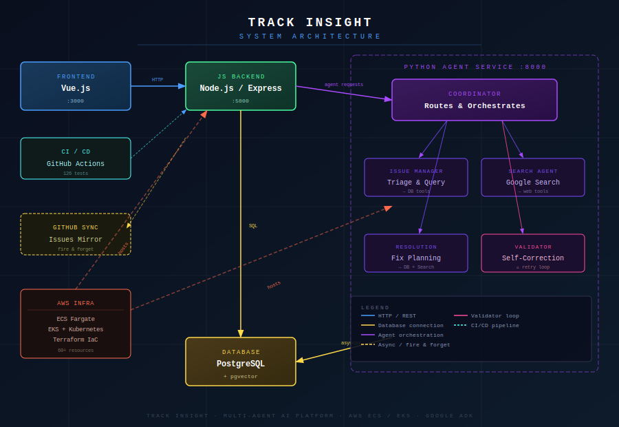

# Track Insight

> Enterprise issue tracking platform with an AI-native architecture. A Google ADK multi-agent system handles autonomous triage, resolution planning, and self-correcting quality assurance. Deployed across AWS ECS Fargate and EKS with Terraform IaC, Docker, and GitHub Actions CI/CD.

[](https://github.com/renuka-dalal/ticket-insight/actions)
[](https://github.com/renuka-dalal/ticket-insight/releases)



→ **[Interactive Architecture](docs/track-insight-interactive.html)** · **[Architecture Decisions](docs/decisions/)** · **[Medium Article](#)**
→ **[Interactive Architecture](docs/track-insight-interactive.html)** · **[Architecture Decisions](docs/decisions/)** · **[HashNode Article](https://rdalal.hashnode.dev/rdalal-notes)**

## Stack

| Layer | Tech |
|---|---|
| Frontend | Vue.js 3, Vite |
| Backend | Node.js, Express, PostgreSQL, pgvector |
| AI | OpenAI GPT-4o-mini, Google Gemini (via ADK) |
| Agent Service | Python 3.11, FastAPI, Google ADK |
| Infrastructure | AWS ECS Fargate, EKS, Terraform, Docker |
| CI/CD | GitHub Actions, AWS CodePipeline, GHCR |
| Testing | Jest, Vitest, Playwright (126 tests, 80%+ coverage) |

---

## Agent System

Five Google ADK agents running in a separate Python FastAPI microservice:

| Agent | Role |
|---|---|
| **Coordinator** | Routes user intent to the right specialist |
| **Issue Manager** | Triages issues — priority, category, assignee from DB context |
| **Search Agent** | Google Search for solutions and documentation |
| **Resolution Agent** | Structured fix plans: root cause, similar issues, references |
| **Validator** | Reviews outputs, triggers self-correction loops (max 2 attempts) |

Chat messages are keyword-routed in the Node.js backend — agent-specific requests hit the Python service, everything else uses OpenAI.

---

## API

**Node.js**
```
GET/POST/PUT/DELETE  /api/issues/:id      Issue CRUD
POST                 /api/issues/:id/comments
GET                  /api/stats           Dashboard metrics
POST                 /api/ai/chat         OpenAI or agent-routed
POST                 /api/chat/agent      Direct coordinator proxy
```

**Python Agent Service**
```
POST  /api/agents/chat     Coordinator entry point
POST  /api/agents/triage   Issue Manager
POST  /api/agents/resolve  Resolution Agent
POST  /api/agents/search   Search Agent
```

---

## Deployment

| Platform | Details |
|---|---|
| **Render** | Primary dev/staging — auto-deploys on push to main |
| **AWS ECS Fargate** | Production path via GitHub Actions + AWS CodePipeline · [Screenshots](docs/aws-deployment/screenshots/ecs-deployment/) |
| **AWS EKS** | Kubernetes deployment via `k8s-manifests/` · [Screenshots](docs/aws-deployment/screenshots/eks-deployment/) |

> *Note: AWS deployments are for demonstration purposes and are not currently live. See [screenshots](docs/aws-deployments/) and Terraform configurations in the repo.*

---

## Infrastructure

Deployed on AWS in two configurations — see [ADR-001](docs/decisions/001-ecs-vs-eks.md) for the rationale:

- **ECS Fargate** — serverless containers, no EC2 management, primary production path
- **EKS** — Kubernetes manifests for portability and cluster-level control
- **Terraform** — 60+ AWS resources provisioned as code (VPC, RDS, ALB, ECR)
- **RDS PostgreSQL** — private subnet with pgvector extension enabled

---

## CI/CD

- PRs trigger linting, 126 tests, E2E across 3 browsers, Docker builds, security scanning
- Git tags (`v*`) publish Docker images to GHCR and create GitHub Releases
- Dependabot manages weekly dependency updates (minor/patch only)

---

## Architecture Decisions

| ADR | Decision |
|---|---|
| [001](docs/decisions/001-ecs-vs-eks.md) | ECS Fargate + EKS both implemented |
| [002](docs/decisions/002-python-agent-microservice.md) | Separate Python microservice for agents |
| [003](docs/decisions/003-pgvector-over-chromadb.md) | pgvector over ChromaDB |
| [004](docs/decisions/004-non-blocking-agent-calls.md) | Non-blocking agent calls with graceful degradation |
| [005](docs/decisions/005-validator-self-correction-pattern.md) | Validator self-correction pattern |
| [006](docs/decisions/006-multi-agent-over-single-llm.md) | Multi-agent over single LLM call |

---

## Future Enhancements

- **LLM-based intent routing** — replace keyword matching with a lightweight classification call to route chat messages to the agent service more reliably
- **LangFuse observability** — agent trace logging and latency monitoring via LangFuse

